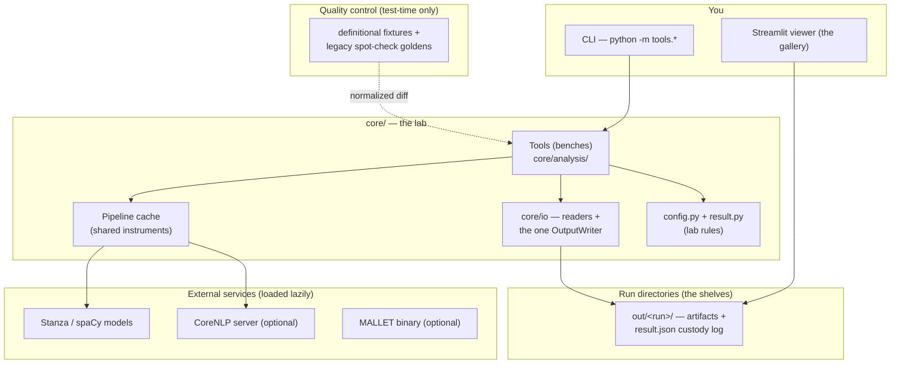
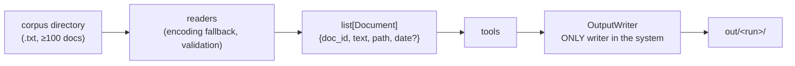
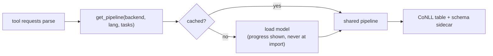
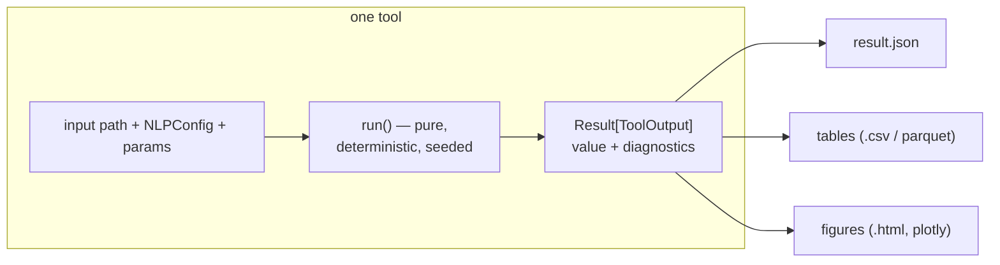
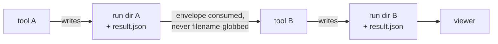
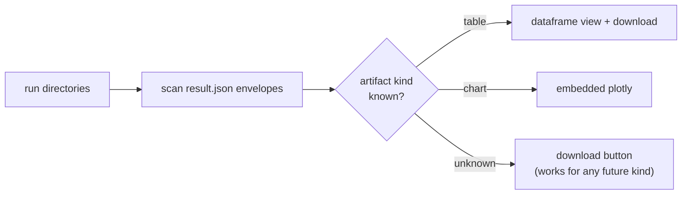
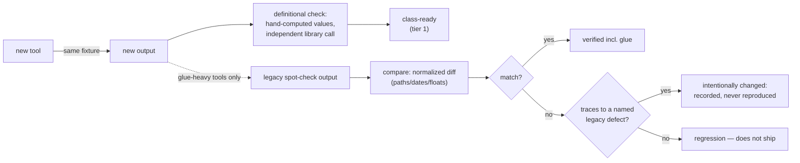
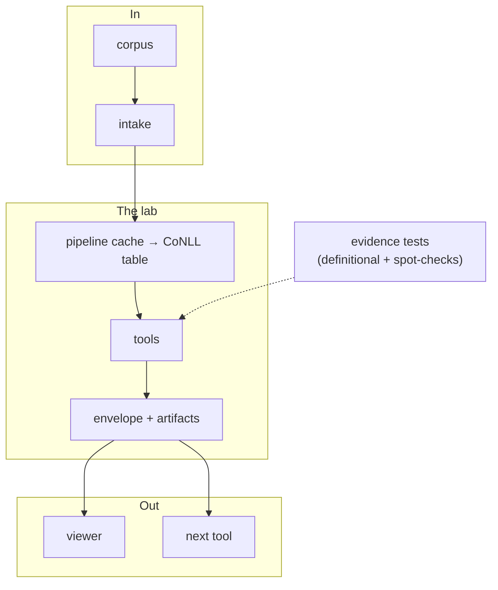
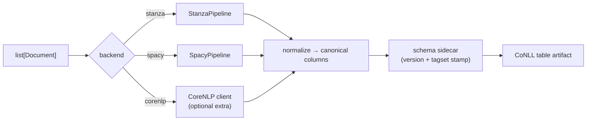
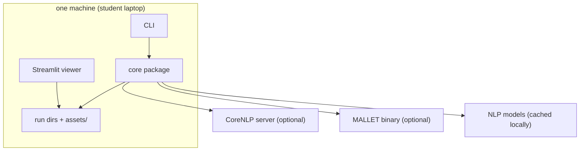

# System Design — NLP Suite NG (working title)

> Architectural overview of the NLP Suite rebuild.
> Read this alongside the defect review (why the old design failed),
> `class_build_order.md` (what's needed when), and the runbook (how work is
> executed and verified). Decisions here are the current *agreed* ones.
>
> Status: the 52-chunk scaffold (`docs/CHUNK_LEDGER.md`) is implemented and
> green; every diagram below describes that scaffold as built. Remaining
> feature parity, product, and release work is tracked in
> `docs/FULL_REPLACEMENT_PLAN.md` and `docs/REPLACEMENT_LEDGER.md`.

---

## 0. TL;DR

A headless Python toolkit for corpus NLP: tools are plain functions that take
data in and return typed results; every run writes a small set of files capped
by a `result.json` envelope with full provenance; a generic Streamlit viewer
renders any run; correctness rests on stratified evidence — hand-computed
definitional tests against independent references first, captured legacy
spot-checks only where the legacy adds its own glue behavior.

- **Core:** Python package under `core/`, one module per subsystem; no GUI below `app/`
- **Interchange:** one versioned **CoNLL table** format (name-addressed columns,
  schema sidecar) — the single data structure every analysis consumes
- **Parsing:** one `Pipeline` protocol over Stanza / spaCy / CoreNLP, behind a
  process-wide cache; models load lazily, never at import
- **Tools:** DataFrame-in / `Result`-out functions + a thin CLI each; Streamlit
  is a generic envelope renderer with zero business logic
- **Provenance:** every run emits an **artifact envelope** (`result.json`) —
  params, input hashes, outputs, diagnostics. Tools consume each other's
  envelopes, never filenames discovered by globbing
- **Correctness:** the legacy suite is kept as a **read-only oracle** — read
  as a specification (options, entry points, known defects), not copied as
  architecture. Package-backed analyses are verified against independent
  references (hand-computed values, the backing library itself); captured
  legacy outputs are used only as spot-checks where the legacy adds its own
  behavior on top of packages (Gate B tiers in
  `FULL_REPLACEMENT_PLAN.md`). Legacy defects are deliberately not
  reproduced — every intentional divergence is documented
- **Legacy license:** GPL-3.0 derivative; the oracle directory is never
  distributed

---

## 1. High-level architecture

Think of the system as an **analysis lab with a chain of custody**:

- **Corpus intake** is *receiving* — samples arrive, get logged, and are never
  modified. (The legacy lab rewrote samples on the bench.)
- **The pipeline cache** is the *shared calibrated instruments* — loaded once,
  used by every bench. (The legacy lab bought a new instrument per
  measurement — 100,000 pipeline instantiations per corpus.)
- **The CoNLL table** is the *standard assay sheet* — one versioned format
  every bench reads by column name. (The legacy lab read columns by position
  and argued about whether there were 14 or 15.)
- **Tools** are the *benches* — each does one analysis and writes up results.
- **The artifact envelope** is the *chain-of-custody log* — every result says
  what was analyzed, with what settings, producing which files, with what
  warnings. Benches hand each other custody records, not piles of unmarked
  printouts.
- **The viewer** is the *gallery* — it reads custody logs and displays results.
  It knows nothing about how any bench works.
- **Quality control** is the *old lab's notebooks under glass* — the legacy
  suite's recorded outputs, used only to check that new results match (or
  diverge for a documented reason).

### 1.1 The big picture



### 1.2 Layer — Corpus intake (receiving)



**Analogy:** samples are logged in and handed to benches. Readers never write;
the OutputWriter refuses any path inside an input directory, so a tool
*cannot* modify its own samples even if asked.

**Rules:** reads never write (R3) · input files are hashed into the envelope
(R8) · an empty or unreadable document becomes a diagnostic, not an aborted
run (§2.5).

### 1.3 Layer — Pipelines (the shared instruments)



**Analogy:** one calibrated instrument per (backend, language, task set), signed
out from the instrument room. The legacy lab's always-True language check is
replaced by a real `supports(language, tasks)` gate that fails loudly at
config time.

**Rules:** one cache, keyed by `(backend, language, tasks)` (R5) · language
support is actually validated (R6 config) · CoreNLP is an optional extra —
its Java server weight never gates the default path.

### 1.4 Layer — Tools (the benches)

Every tool is the same shape: one pure `run()` function, one thin CLI, tests.
One parameterized analyzer replaces the six legacy CoNLL analyzer clones;
one parser facade replaces three parallel parser stacks; one sentiment engine
hosts five lexicon/neural backends.



**Rules:** DataFrame-in / Result-out (R7) · no globals (R6) · per-document
failures degrade to diagnostics, never abort the corpus · tools never import
each other's internals — shared logic graduates to `core/` (R10).

### 1.5 Layer — Artifacts (chain of custody)



**Analogy:** benches don't rummage through each other's output piles guessing
which printout is the parse table; they receive a custody record naming
exactly what was produced. This is the structural fix for the legacy
"filesystem is the API, filenames are the protocol" failure — including the
incident where a stray version file was read as a corpus document.

### 1.6 Layer — Viewer (the gallery)



The viewer contains **no business logic**. Unknown artifact kinds degrade to
download-only, so shipping a new tool never requires viewer changes.

### 1.7 Quality control (the old lab's notebooks)

The evidence stack is stratified, because most of the legacy suite wraps
researcher-built packages whose behavior is defined by their published
formulas — not by what the old GUI printed. Only the legacy's own glue
(tie-breaking, rounding, ordering, multi-step workflows) is worth capturing
a run for, since that code provably does not do what it appears to do.



Definitional evidence defines routine correctness; legacy-run goldens cover
only tier-2 glue questions; the defect catalog defines the intentional
exceptions. A tool whose output can't be checked either way because the
legacy version never worked is marked **spec-only** and leans harder on
property tests (§6).

### 1.8 How the layers fit together



---

## 2. Data model

Five small contracts. Everything else in the system is a tool that consumes
or produces them.

### 2.1 Document & Corpus

```python
@dataclass(frozen=True)
class Document:
    doc_id: int  # assigned at intake, dense 1..N — never parsed
    # out of a filename by string chopping
    path: Path
    text: str
    date: date | None  # from filename when embedded (viewer tools need it)


@dataclass(frozen=True)
class Corpus:
    docs: tuple[Document, ...]
    sha256: str  # corpus fingerprint over sorted file hashes
```

**Key decision:** `doc_id` is assigned, not derived. The legacy suite computed
document identity by slicing filename/ID strings (`str(id)[:-2]`), which
corrupts any corpus past 9 documents — and the class corpus is ≥100.

### 2.2 The CoNLL table (versioned)

Required columns (by name): `ID, Form, Lemma, POS, NER, Head, DepRel,
Sentence ID, Document ID, Document`. Auto-generated: `Record ID, Deps,
Clause Tag`.

Every table file ships a sidecar `{table}.schema.json`:

```json
{"schema_version": 1, "pos_tagset": "penn", "parser": "stanza",
 "parser_version": "1.x", "created": "..."}
```

**Key decisions:** columns are accessed through a `Col` enum by *name*;
integer indexing is a lint error. The `pos_tagset` stamp exists because the
legacy analyzer normalized tags in memory, then re-read the raw file and
filtered Universal tags with Penn patterns — producing silently empty
outputs. Sentence division must include the final token of the final
sentence (the legacy dropped it; a regression test guards this).

### 2.3 The artifact envelope (`result.json`)

```json
{
  "tool": "sentiment_vader",
  "created": "2026-08-31T19:00:00Z",
  "params": {"language": "en", "mode": "mean"},
  "inputs": [{"path": "corpus/01.txt", "sha256": "..."}],
  "artifacts": [
    {"kind": "table", "path": "sentiment.csv"},
    {"kind": "chart", "path": "sentiment_by_doc.html"}
  ],
  "diagnostics": [
    {"severity": "warning", "code": "EMPTY_DOC",
     "message": "04.txt had no tokens", "context": {"doc_id": 4}}
  ]
}
```

`kind` is a **free string** (`table`, `chart`, `map`, `report`, ...) so new
artifact kinds need no schema change; the viewer falls back to download-only
for unknown kinds. Keys are emitted in fixed order and floats rounded to 6 dp
so that outputs stay deterministically comparable (spot-check diffs need no
normalization beyond paths/dates). Bulk data lives in CSV/parquet and
is referenced by path — JSON carries metadata and small aggregates only.

### 2.4 Run directory

```
out/<tool>__<timestamp>/
  result.json            # the custody log
  <name>.csv             # table artifacts (+ .schema.json when CoNLL)
  <name>.html            # figure artifacts
  log.txt                # structured log for this run
```

One directory per run; tools never write outside their run directory.

### 2.5 Result & diagnostics

```python
class Severity(Enum):
    INFO, WARNING, ERROR


@dataclass(frozen=True)
class Diagnostic:
    severity: Severity
    code: str  # "EMPTY_DOC", "UNPARSEABLE_DATE", ...
    message: str
    context: dict  # doc_id / sentence_id / row where it happened


@dataclass(frozen=True)
class Result[T]:
    value: T | None
    diagnostics: tuple[Diagnostic, ...]
    # ok == value present AND no ERROR diagnostics
```

**Key decision:** partial success is a first-class shape. A 100-document
corpus with 3 bad documents returns a 97-document result and 3 ERROR
diagnostics. The legacy alternative — abort the whole corpus because one
file was empty — is banned. So is the opposite failure: `None` meaning
"error", "nothing to do", and "empty result" interchangeably.

### 2.6 Config

```python
@dataclass(frozen=True)
class NLPConfig:
    parser: Literal["stanza", "spacy", "corenlp"]
    language: str  # validated against backend support
    encoding: str = "utf-8"
    max_sentence_length: int = 1000
    chart_package: Literal["plotly"] = "plotly"
```

One frozen object, validated at construction, passed explicitly to every
tool. In the legacy suite each tool decided whether to obey the configured
language — "configuration existed; obedience was optional." Here obedience is
enforced by there being nothing else to read.

---

## 3. Parse pipeline



**Steps:** documents enter → the cached pipeline for `(backend, language,
tasks)` parses → output normalizes to canonical columns (port of the legacy
`normalize_to_canonical` + Universal→Penn mapping, the good code) → sidecar
stamped → table registered as an artifact.

**Rules:** one empty document logs `EMPTY_DOC` and the run continues (legacy:
`break` abandoned the remaining corpus) · parse output is a normal artifact,
so downstream tools consume it through the envelope · per-word or
per-sentence pipeline construction is rejected at review, no exceptions.

## 4. Tool execution flow

```mermaid
sequenceDiagram
    participant U as You
    participant C as tools/&lt;tool&gt; (CLI)
    participant R as analysis.&lt;tool&gt;.run
    participant P as pipeline cache
    participant W as OutputWriter

    U->>C: python -m tools.&lt;tool&gt; corpus/ out/
    C->>R: run(input, cfg, **params)
    R->>P: get_pipeline(...) (if needed)
    P-->>R: cached pipeline
    R-->>C: Result[ToolOutput]
    C->>W: write_run(result)
    W->>W: artifacts + result.json (fixed key order)
    W-->>U: exit 0, or exit 1 + diagnostic summary
```

**Tool anatomy:** `core/analysis/<tool>.py` (pure logic) · `tools/<tool>.py`
(CLI template, ~15 lines) · tests · optionally one line in the viewer's page
registry. Nothing else. The CLI is the only place that parses argv; the
writer is the only place that touches disk.

## 5. Viewer flow

The Streamlit app scans run directories, groups envelopes by tool and date,
and renders artifacts by `kind`. There is no per-tool code path — the app
shipped with the first tool and never changes when tools are added.
Long-running analyses execute in a worker that writes the run directory; the
UI polls the envelope — pipelines never run in the render path.

## 6. Verification architecture

Four independent oracles; expected values always originate outside the
generation process.

| Oracle | What it proves | Form |
|---|---|---|
| Definitional evidence | Correctness of package-backed analyses against their domain spec | hand-computed fixtures + direct calls to the backing library |
| Golden diff | Glue behavior of the legacy (tier-2 questions only: ordering, rounding, workflows) | normalized `diff` per tool, captured opportunistically |
| Anti-regression tests | Each confirmed legacy defect is gone | tests that **fail against the legacy module** |
| Property tests | Structural truth regardless of implementation | row-count conservation, POS counts sum to tokens, no NaN in required columns, sidecar present, envelope validates |

Plus one CI-level guard: an import test that imports every module with the
network disabled and the working directory changed — the import-time-side-
effect ban is enforced mechanically, not by vigilance.

## 7. External models & services

| Dependency | Role | Load policy |
|---|---|---|
| Stanza | default parser backend | lazy, cached, `download_method=None`; models must be installed explicitly and missing/unreadable resources fail with an actionable diagnostic |
| spaCy | alternate backend | lazy, cached |
| CoreNLP (Java server) | optional backend + special annotators | `[corenlp]` extra; never on the default path |
| MALLET binary | topic modeling | optional; shelled through the one subprocess wrapper |
| sentence-transformers / BERT | embeddings, WSI | lazy, cached |
| Lexicons (VADER, ANEW, SentiWordNet, hedonometer) | sentiment backends | data files in `assets/`, loaded once |
| Local LLM (Ollama) | Tier-4 experimental exploration tool only | explicit opt-in; off the graded-analysis path |

**"Services earn their role":** a dependency joins the default install only
when a Tier-1 tool needs it. Everything else is an optional extra.

## 8. Extensibility (slide-in-and-play, by construction)

Adding a tool is additive-only: one analysis module, one CLI, tests, an
optional viewer-registry line. What makes it cheap is *architectural*, not
procedural:

- **Contracts are closed.** Tools never edit `result.py`, `config.py`, the
  CoNLL schema, or the Pipeline protocol. A needed contract change is its own
  reviewed task, never a drive-by edit inside a tool.
- **The envelope absorbs novelty.** New artifact `kind`s require no schema or
  viewer changes.
- **No tool-to-tool imports.** Shared logic moves to `core/`; tools stay
  leaves. This is the structural opposite of the legacy copy-paste drift.
- **Network is injected.** Tools receive clients; tests run offline.

Anything excluded from the initial inventory (PC-ACE, knowledge-graph
annotators, DB tools) is one additive pass away from existing — no redesign.

## 9. Deployment topology



Single-user, single machine, no services required by default. The laptop fan
stays quiet because nothing loads until a tool asks for it — the legacy
"inferno launch" was import-time model downloads, which the import rule bans.

## 10. Architectural invariants (enforced, not aspirational)

| # | Invariant | Enforcement |
|---|---|---|
| R1 | No import-time side effects | CI import test (network off, CWD changed) |
| R2 | No bare `except:` | ruff E722/B001 |
| R3 | Reads never write; analysis artifacts and run directories only via OutputWriter | `tests/test_write_custody.py` allowlist + OutputWriter refuses input paths |
| R4 | Errors are `Result` + diagnostics; no UI below `app/` | import-linter layer rule |
| R5 | Models load once | the one pipeline cache |
| R6 | No global mutable state | config dataclass; review |
| R7 | One return shape per function | typing + review |
| R8 | Tools interoperate via envelopes only | no filename-globbing reads |
| R9 | Versioned, name-addressed CoNLL | `Col` enum; sidecar required |
| R10 | One implementation per concept | shared logic graduates to `core/` |
| R11 | No secrets in source; `pathlib`; one subprocess wrapper | gitleaks + review |

**Cross-cutting:** structured `logging` per tool (no `print` in library
code) · seeded RNGs everywhere (charts and embeddings are reproducible) ·
quality gate `pytest && ruff && mypy` before any tool is declared done.

**Never reintroduce (legacy greatest hits):** `eval` on files ·
`os.chdir`/`sys.path` mutation · runtime pip-install guards · messageboxes as
error channels · `str.split('')` · `[:-4]` extension chopping ·
`if 'a' or 'b' in list` · `shell=True` / `sudo Python` · globals read via
`globals()['x'].get()`.

## 11. Open decisions

- Final package name (`nlp-suite-ng` is a placeholder).
- Static chart export (kaleido pin) vs HTML-only figures for v1.
- Whether the Streamlit viewer ships in v1 or the CLI stands alone first.
- CoreNLP special annotators (quote/gender/date): port via the Java backend
  or reimplement the dictionary-driven parts in pure Python.

## 12. Definition of done

Point the CLI at a ≥100-document class corpus and run every tool the syllabus
requires, end to end, with the fan quiet. Every run directory carries a valid
envelope; every number either matches the legacy oracle or is annotated in
`GOLDENS.md` as an intentional fix; every confirmed legacy defect has a
failing-against-legacy regression test; the viewer renders any run without
tool-specific code; and adding the next tool touches zero existing files
besides its own.
